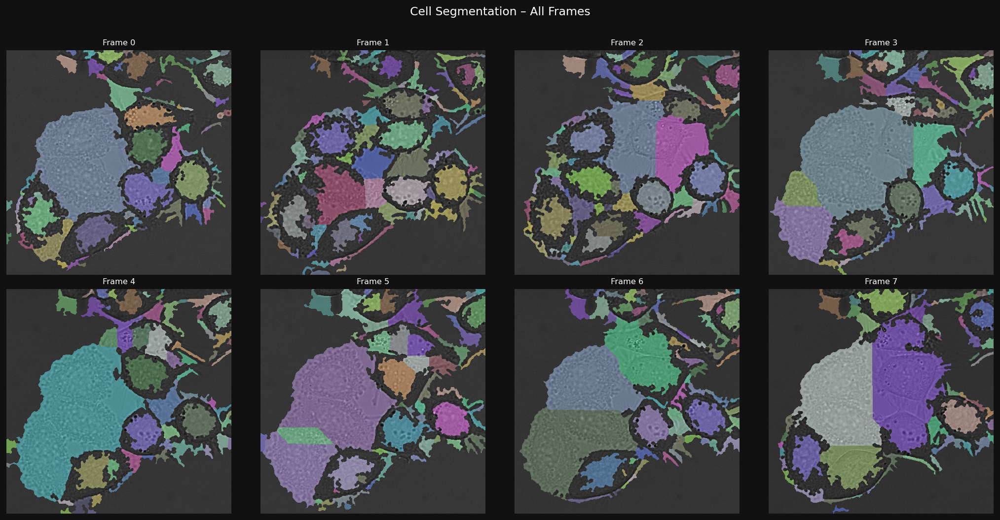
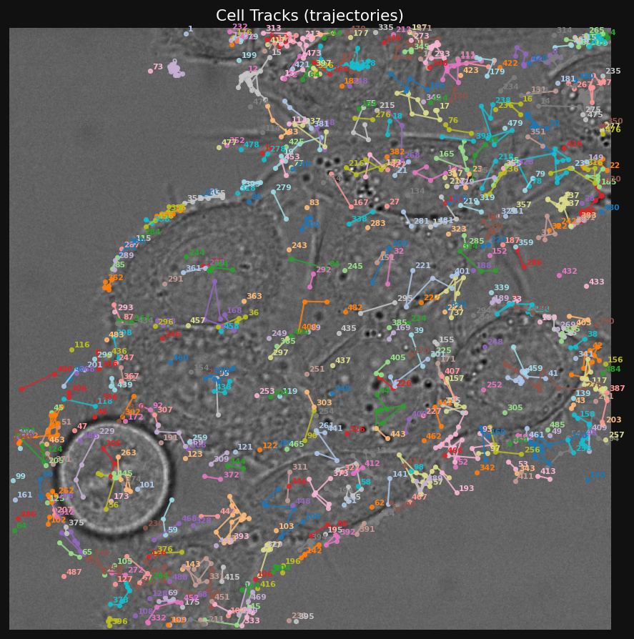
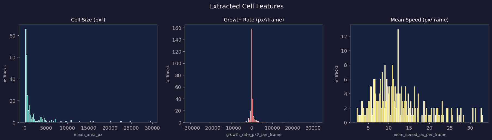
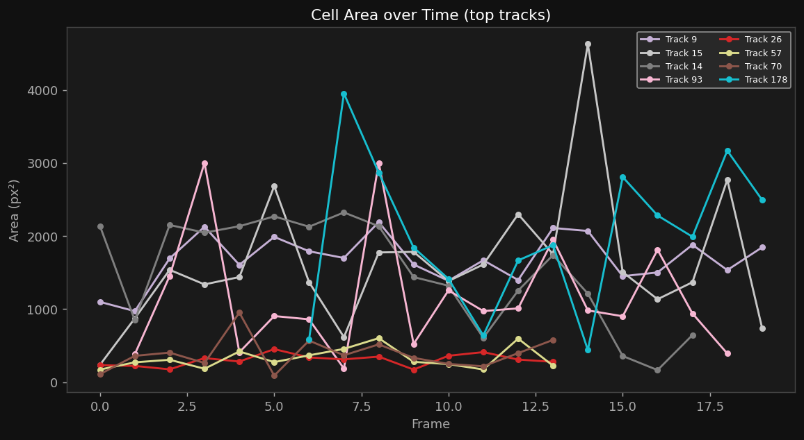
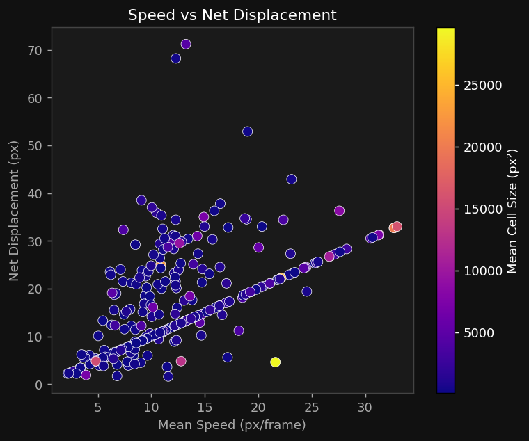

# 🧬 Single-Cell Segmentation & Tracking Pipeline


A lightweight Python pipeline for **detecting, segmenting, tracking, and analyzing single cells** in microscopy time-lapse.

Designed for:

* 🔬 Computational biology research
* 🧪 Cell motility analysis
* 📊 Feature extraction for ML pipelines
* 🎓 Educational and research use

---

## 🚀 Quick Start (Synthetic Demo)

```bash
pip3 install numpy scipy scikit-image matplotlib pandas tifffile
python3 pipeline.py
```

📁 Output will be generated in the `results/` directory.

---

## 🧪 Demo Result (Single Sample)

To demonstrate the pipeline, we run it on one full-time-lapse sequence from the dataset.

### Demo Output







---

## 🧫 Real Dataset Usage (Cell Tracking Challenge)

This pipeline supports real biological datasets from the **Cell Tracking Challenge**.

### 1. Download Dataset

[https://celltrackingchallenge.net/datasets/](https://celltrackingchallenge.net/datasets/)

Used Dataset: **DIC-C2DH-HeLa**

### 2. Expected Structure

```
DIC-C2DH-HeLa/
 └── 01/
     ├── t000.tif
     ├── t001.tif
     └── ...
```

### 3. Run Pipeline

```bash
python3 ctc_loader.py --data_dir DIC-C2DH-HeLa/01 --max_frames 30
```

---

## 🧠 Pipeline Overview

| Stage                | Module      | Function                      |
| -------------------- | ----------- | ----------------------------- |
| Synthetic generation | pipeline.py | generate_synthetic_sequence() |
| Segmentation         | pipeline.py | segment_frame()               |
| Feature extraction   | pipeline.py | extract_cell_props()          |
| Tracking             | pipeline.py | track_cells()                 |
| Trajectory analysis  | pipeline.py | extract_track_features()      |
| Visualization        | pipeline.py | visualize_pipeline()          |

---

## 🔬 Segmentation Pipeline

```
Raw Microscopy Frame
      ↓
CLAHE Contrast Enhancement
      ↓
Gaussian Smoothing (σ = 2)
      ↓
Otsu Thresholding
      ↓
Morphological Closing + Hole Filling
      ↓
Distance Transform
      ↓
Local Maxima Detection
      ↓
Watershed Segmentation
      ↓
Final Labeled Cell Mask
```

---

## 📍 Tracking Strategy

* Greedy nearest-neighbor matching
* Euclidean centroid distance
* Max linking distance: 35 px
* New track IDs created for unmatched detections

---

## 📊 Extracted Features

| Feature                   | Description               |
| ------------------------- | ------------------------- |
| mean_area_px              | Average cell area         |
| growth_rate_px2_per_frame | Growth trend over time    |
| mean_speed_px_per_frame   | Motion speed              |
| total_path_px             | Total trajectory length   |
| net_displacement_px       | Start-to-end displacement |

---

## 📁 Output Structure

```
results/
│
├── A_segmentation_grid.png
├── B_cell_tracks.png
├── C_feature_histograms.png
├── D_area_over_time.png
├── E_speed_vs_displacement.png
│
├── track_data.csv
└── cell_features.csv
```

---

## 🧩 Key Highlights

* ⚡ Lightweight classical CV pipeline
* 🧠 No deep learning dependency
* 📦 Modular and extensible design
* 🔬 Research-ready implementation
* 📊 ML feature extraction enabled

---

## 🔮 Future Improvements

* U-Net based segmentation upgrade
* SORT / DeepSORT tracking integration
* GPU acceleration support
* Real-time microscopy processing
* Multi-class cell phenotype classification
